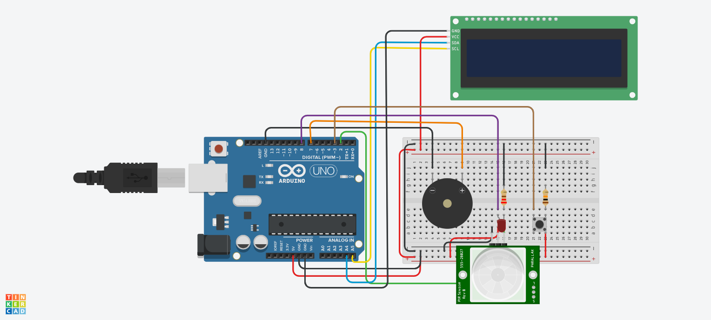

# Human Detection Probe (IoT 261)

**Course:** IOT261 - Internet of Things  
**Grade:** 77% (Distinction)  
**Date:** April 2026

---

## 📋 Project Overview

A human detection system using an Arduino Uno and PIR sensor designed for post-earthquake search and rescue operations. The system detects human presence behind rubble and triggers alerts via buzzer and LED indicators.

**Real-world application:** Search and rescue after earthquakes or building collapses.

---

## 🔧 Components Used

| Component | Purpose |
|-----------|---------|
| Arduino Uno | Main controller |
| PIR Sensor | Human motion detection |
| Piezo Buzzer | Audible alarm |
| Red LED | Visual alarm |
| 16x2 I2C LCD | Status display |
| Push Button | Alarm reset |
| Resistors | Circuit protection |

---

## 📐 Circuit Design

### Key Connections:
- **PIR Sensor** → D2 (Digital pin 2)
- **LED** → D7 with 220Ω resistor
- **Buzzer** → D8
- **Push Button** → D3 with 10kΩ pull-down resistor
- **LCD** → SDA (A4), SCL (A5)



### Eagle Board Design:
The circuit was professionally designed using Eagle CAD software, demonstrating PCB design capabilities.

---

## 💻 How It Works

1. **Human Detection:** PIR sensor detects infrared radiation from humans
2. **Alarm Activation:** Buzzer sounds and LED flashes when human detected
3. **LCD Display:** Shows "Human Detected!" or "Status: Normal"
4. **Reset Button:** Silences alarm and resets system

---

## 🎯 Key Features

- ✅ Real-time human detection
- ✅ Audible and visual alerts
- ✅ LCD status updates
- ✅ Manual alarm reset
- ✅ Post-earthquake rescue focus

---

## 🔬 Testing Results

| Test | Result |
|------|--------|
| Human Detection | ✅ PIR sensor triggered reliably |
| Alarm Activation | ✅ Buzzer and LED responded |
| Alarm Reset | ✅ Push button successfully reset |
| LCD Display | ✅ Dynamic status updates |

---

## 🛠️ Technologies Used

- **Arduino Uno** (C++ programming)
- **PIR Sensor** (HC-SR501)
- **I2C LCD** (16x2 with I2C backpack)
- **Eagle CAD** (Circuit design)
- **Tinkercad** (Circuit simulation)

---

## 📱 Code Snippet

```cpp
// PIR Sensor input
int pirPin = 2;
int ledPin = 7;
int buzzerPin = 8;
int buttonPin = 3;

void setup() {
  pinMode(pirPin, INPUT);
  pinMode(ledPin, OUTPUT);
  pinMode(buzzerPin, OUTPUT);
  pinMode(buttonPin, INPUT);
  
  // Initialize LCD
  lcd.init();
  lcd.backlight();
}

void loop() {
  int pirState = digitalRead(pirPin);
  
  if (pirState == HIGH) {
    // Human detected!
    digitalWrite(ledPin, HIGH);
    tone(buzzerPin, 1000);
    lcd.print("Human Detected!");
  }
  // ... rest of code
}
